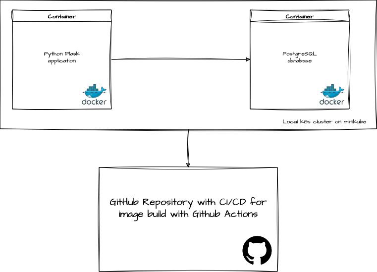

# Introduction
The following repo gives a basic implementation of a Python Flask application with connectivity to a database. The main idea is to show a simple setup in a containerized eenvironment (both supported local and in a kubernetes cluster). Local setup is possible with Docker compose and minikube (for k8s validaion). For Kubernetes we have a Helm charts for the Python application and PostgreSQL database instance (simple deployment and stateful set). The repository provides integration for CI/CD for building both application and database images with Github Actions.

The whole implementation and workflow is documentated in 'Issues' tab of the project. Where we have the main requirements splited by diferent segments of the project.

# Requirements

To be able to test the implementation you need to have locally:
* Docker Desktop/daemon;
* docker compose plugin install;
* minikube or kind;
* Helm;

# Local test with docker compose

To spin-up local development environment run:

```
docker compose up -d
```

# Test the helm charts

For our solution we use minikube.

```
minikube start
cd charts/
helm dep up python-app
helm install app python-app
```

# CI/CD implementation

The CI/CD is implemented with GitHub Actions for more information check .github/workflows folder and 'Actions'.

# Image repository

All builded images are stored in Docker Hub both on **ARM/AMD64 architectures**:
* https://hub.docker.com/repositories/dstefanow

# Project architecture

The following diagram shows basic concept of the architecture:


